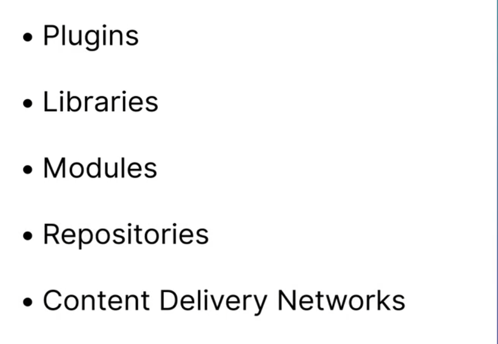

# 🫥 Software and Data Integrity Failures

## What is software and data Integritry Failures?

Software and data integrity <mark style="background-color:purple;">failures relate to code and infrastructure that does not protect against integrity violations</mark>. An example of this is where an application <mark style="background-color:blue;">relies upon plugins, libraries, or modules from untrusted sources, repositories, and content delivery networks (CDNs)</mark>. An insecure CI/CD pipeline can introduce the potential for unauthorized access, malicious code, or system compromise

<figure><figcaption></figcaption></figure>

<figure><figcaption></figcaption></figure>

## Software and data integrity Failures relies on external things :thumbsup:

<figure><figcaption></figcaption></figure>

## Subresources Integrity(SRI)

## Content Delivery Network(CDN)

## Deserialization

It is the process of Structured data and creating an object from it

## Digital Signature :&#x20;

HMAC to ensure the data comes from a trusted source and has not been modified&#x20;

## Dependency - Check

To ensure our libraries are up-to -date and that we are using trusted repositories

## Harden

To ensure it cannot be targeted to inject malicious Code

## Subresource Integrity

To ensure remote version has not been modified without our knowledge

